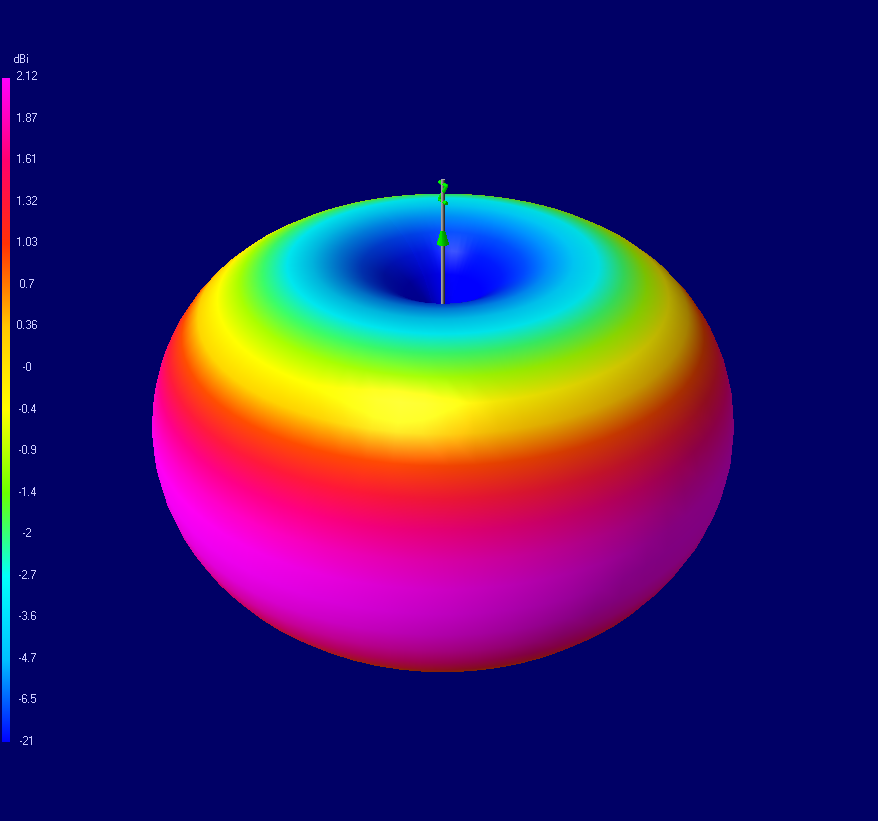
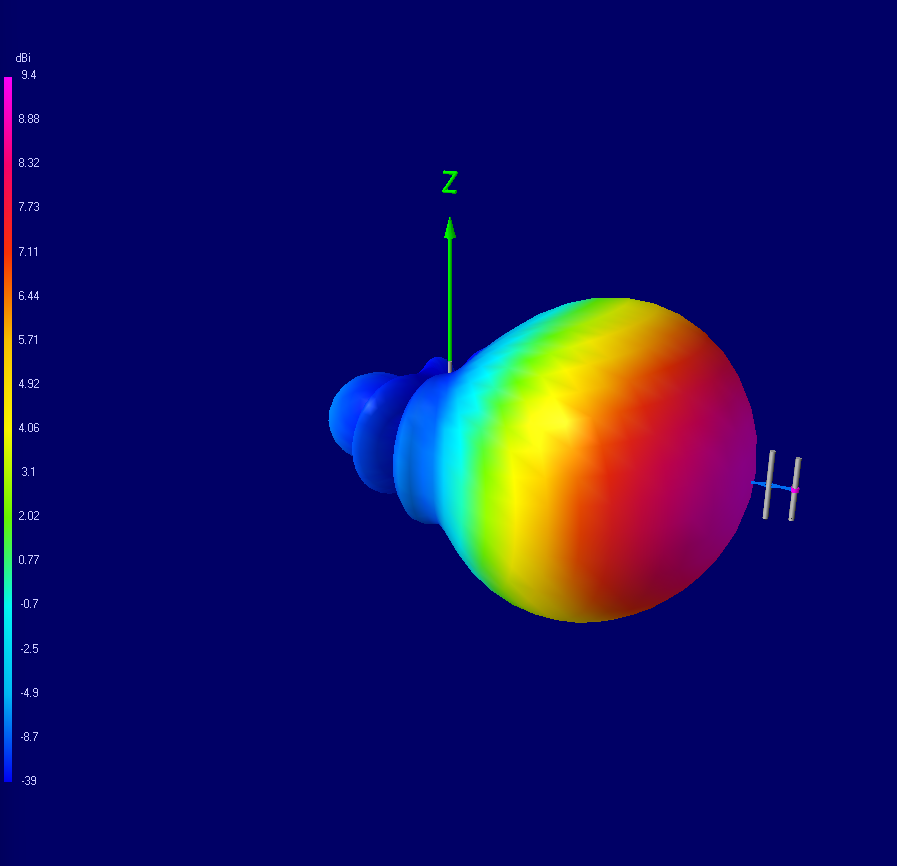
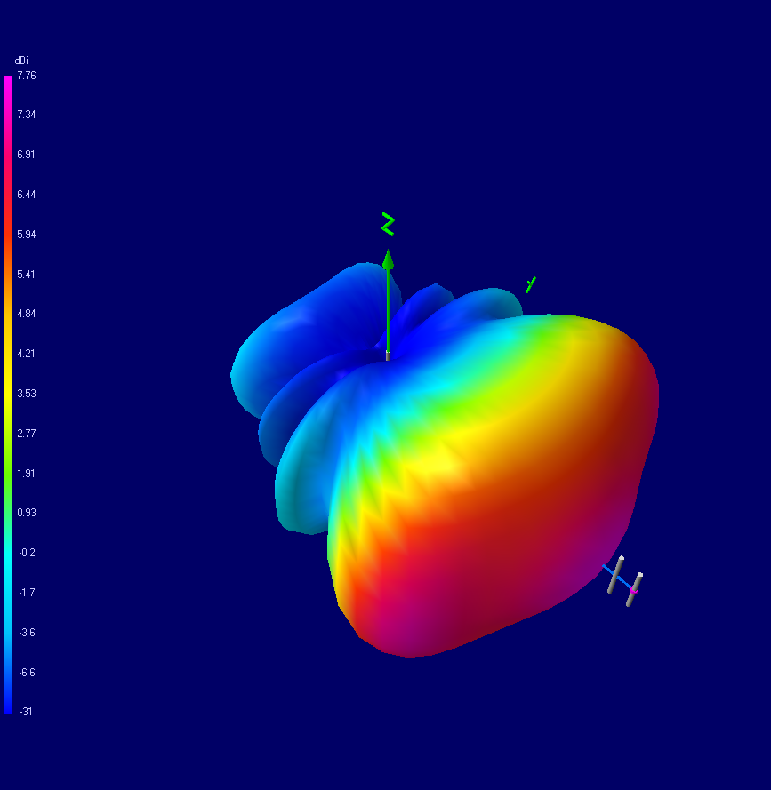
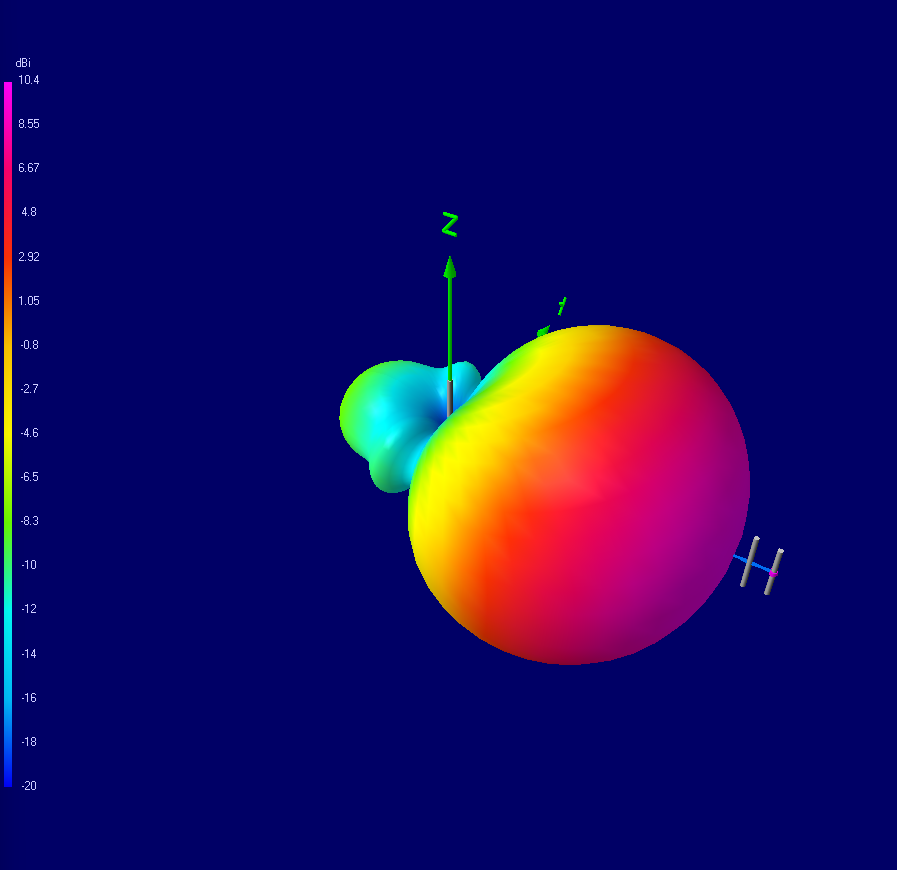

# Simulações de Antenas com 4NEC2

Este repositório disponibiliza modelos e resultados de simulação eletromagnética de antenas dipolo e log-periódica, desenvolvidos utilizando o software 4NEC2 (Numerical Electromagnetics Code).

Os materiais aqui apresentados visam apoiar a reprodutibilidade dos resultados descritos no estudo científico associado sobre modelagem e análise de antenas.

---

- `net_files/`: Arquivos de entrada (.nec) contendo a definição das geometrias das antenas e parâmetros de simulação  
- `output/`: Resultados gerados pelo 4NEC2, incluindo dados de campo e análises em frequência  
- `images/`: Diagramas de radiação tridimensionais obtidos a partir das simulações  

---

## Ambiente de Simulação

Todas as simulações foram realizadas utilizando o software **4NEC2**, baseado no Método dos Momentos (MoM).

---

## Simulação da Antena Dipolo

- Frequência de operação: **600 MHz**

O modelo de antena dipolo foi analisado com o objetivo de obter:

- Características de radiação em campo distante (far-field)  
- Distribuição de campo próximo (near-field)  
- Resposta em frequência (varredura)

### Diagrama de Radiação 3D

---

## Simulação da Antena Log-Periódica (LPDA)

- Faixa de frequência: **480–720 MHz**

O modelo da antena log-periódica foi avaliado em banda larga, permitindo a obtenção de:

- Características de radiação em campo distante (far-field)  
- Distribuição de campo próximo (near-field)  
- Análise por varredura em frequência  

### Diagramas de Radiação 3D

**Frequência Central**  

**Frequência Máxima**  

**Frequência Mínima**  

---

## Dados de Saída

O diretório `output/` contém arquivos de saída (.out) gerados pelo 4NEC2, incluindo:

- Dados de radiação em campo distante  
- Dados eletromagnéticos de campo próximo  
- Resultados de varredura em frequência  

Esses dados permitem a verificação independente e a análise detalhada do desempenho das antenas simuladas.

---

## Reprodutibilidade

Todos os modelos de antena estão disponíveis no diretório `net_files/` no formato padrão NEC.  
As simulações podem ser reproduzidas executando esses arquivos no ambiente 4NEC2, sob condições equivalentes de configuração.

---

## Citação

Caso este repositório contribua para seu trabalho, recomenda-se citar o estudo associado e/ou o conjunto de dados (DOI, se disponível).

---

## Licença

Este repositório destina-se a fins acadêmicos e de pesquisa. Consulte o arquivo LICENSE para mais informações sobre os termos de uso.